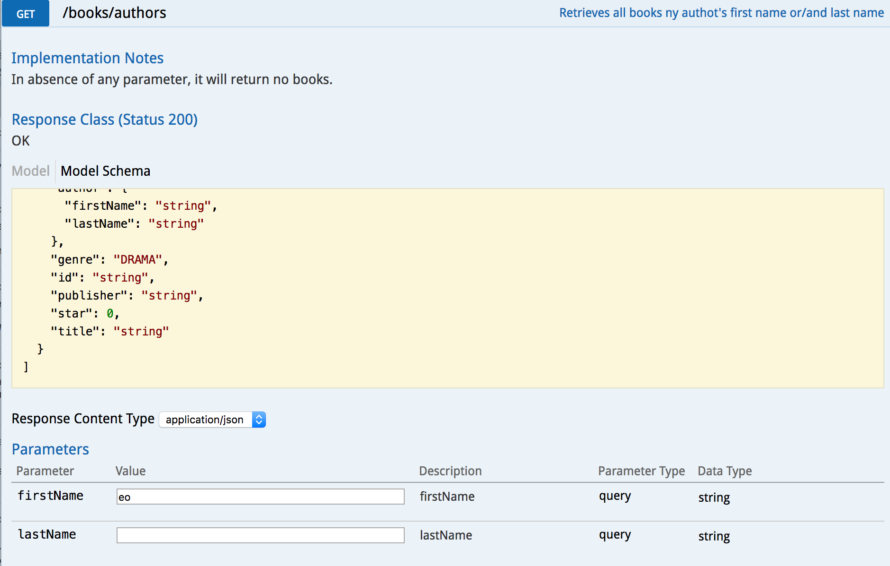
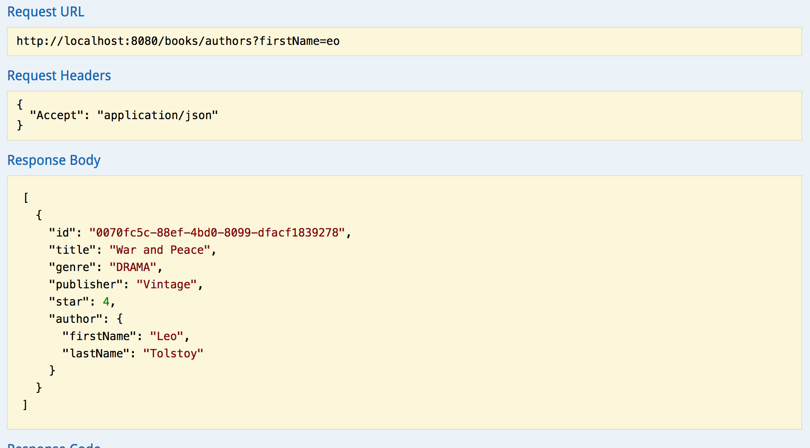

[![Build Status][travis-badge]][travis-badge-url]

JPA PostgreSQL Spring Service Example with JSONB Column Type and Query By Example
=================================================================================
This is a [**Spring Boot**](https://projects.spring.io/spring-boot/) based microservice example backed by
[**PostgreSQL**](https://www.postgresql.org/) database. This examples shows how to do the following:
* Use `DBCP datasource` with Java configuration.
* Use `Custom Repository` to expose `entity manager`.
* Insert `UUID` field in Postgres database and generate `UUID `index.
* Convert Java `Enum` to Postgres `Enum` type.
* Convert Java `Object` to Postgres `JSONB` type.
* Use [`JPA Query by Example`](https://github.com/spring-projects/spring-data-commons/blob/master/src/main/asciidoc/query-by-example.adoc)
* Use [`Dozer`](http://dozer.sourceforge.net/) Java Bean mapper.

### PostgreSQL Assumptions
* You have a PostgreSQL database server running on your `localhost` and in port `5432`.
* You have a database named `postgres` running on the server
* The server has a user named `postgres` with password `postgres`.
* If any of the assumptions doesn't hold true, change the `spring.datasource` properties in the `application.yml` file.

### Create Database Entities
Execute the `create-db.sql` script under `resources` directory on your PostgreSQL server either using  PostgreSQL administration and management tools, [pgAdmin](https://www.pgadmin.org/), 
or from the PostgreSQL interactive terminal program, called `psql`.

### Build
Execute the following command from the parent directory:
```
mvn clean install
```

### Start the Service
The main entry point `jpa-postgres-jsonb` example is `com.basaki.example.postgres.jsonb.boot.BookApplication` class.
You can start the application from an IDE by starting the `BookApplication` class.
```

  .   ____          _            __ _ _
  .   ____          _            __ _ _
 /\\ / ___'_ __ _ _(_)_ __  __ _ \ \ \ \
( ( )\___ | '_ | '_| | '_ \/ _` | \ \ \ \
 \\/  ___)| |_)| | | | | || (_| |  ) ) ) )
  '  |____| .__|_| |_|_| |_\__, | / / / /
 =========|_|==============|___/=/_/_/_/
 :: Spring Boot ::        (v1.4.5.RELEASE)
 ...
2017-03-27 23:09:46.905  INFO 44570 --- [           main] s.b.c.e.t.TomcatEmbeddedServletContainer : Tomcat started on port(s): 8080 (http)
2017-03-27 23:09:46.911  INFO 44570 --- [           main] c.b.e.postgres.boot.BookApplication      : Started BookApplication in 7.003 seconds (JVM running for 7.422)
```
The application starts up at port `8080`.

### Accessing Swagger 
On your browser, navigate to `http://localhost:8080/` to view the Swagger. 


Click the `Show/Hide` link to view all the operations exposed by Book API.

#### POST Example
Once expanded, create a new Book entry by clicking `POST` and entering the following JSON snippet in the `request` field and click `Try it out!`. 


Here is the response you get back. 


#### GET Example
To view all books, click `GET` and enter either `title`, `author`, `genre` or any combination of them and click lick `Try it out!`. 
The `title` and `author` parameters are case insensitive. This is an example by query.
Here is the response you get back:


#### GET Example by Author
To view all books by author, click `GET` and enter either author's `first name`, `last name` or any combination of them and click lick `Try it out!`. 
The `first name`, `last name` parameters are case insensitive and doesn't have to be complete names. This is an native query on JSON object.
Here is the response you get back:


Here is the response you get back.



[travis-badge]: https://travis-ci.org/indrabasak/jpa-postgres-jsonb.svg?branch=master
[travis-badge-url]: https://travis-ci.org/indrabasak/jpa-postgres-jsonb/